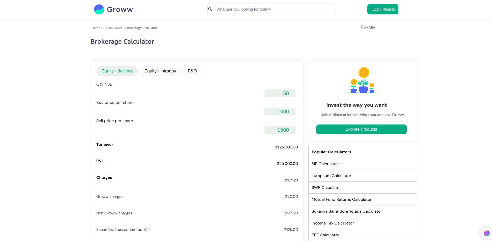
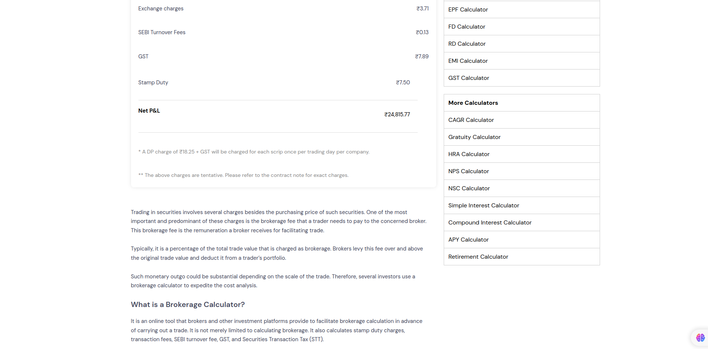
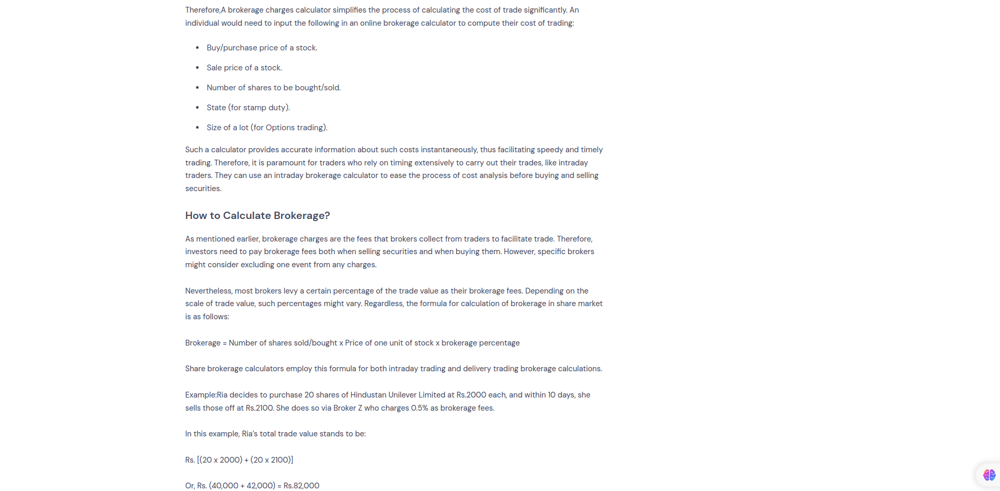
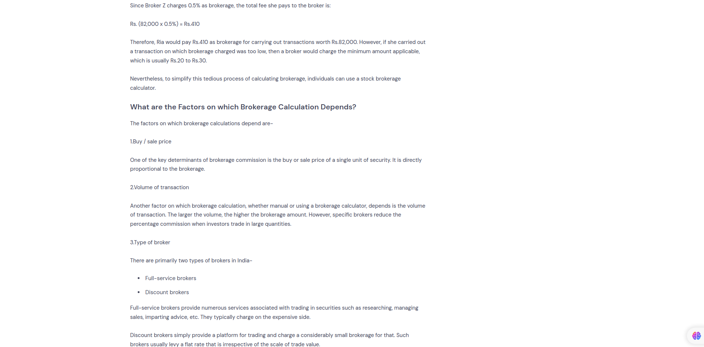
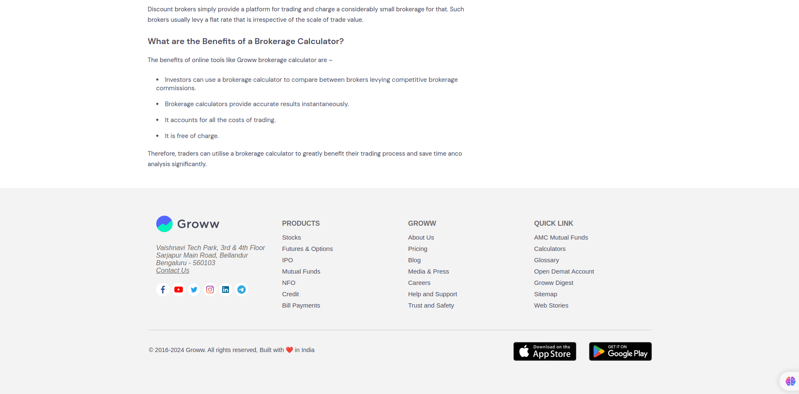
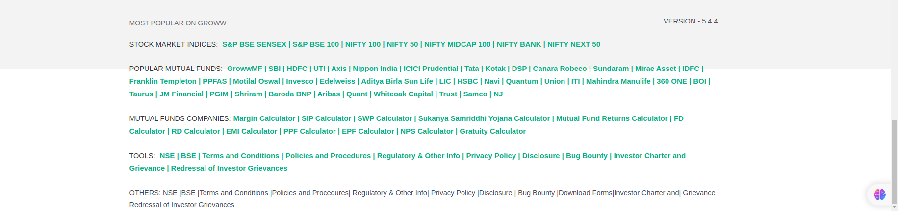

# groww-clone-frontend

groww clone using HTML & CSS
 
My second project, where I recreated the Groww website using HTML and CSS, focusing on replicating the design and user interface for a realistic look and feel.
<h2>Screenshots</h2>

